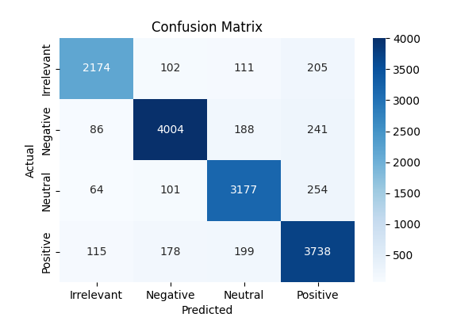

# PRODIGY_DS_04
# 📊 Twitter Sentiment Analysis on Entity Data

This project analyzes sentiment patterns in Twitter data to understand public opinion about specific brands or topics. We used the [Twitter Entity Sentiment Analysis dataset](https://www.kaggle.com/datasets/jp797498e/twitter-entity-sentiment-analysis) from Kaggle.

## 🧠 Objective

To clean, process, and visualize tweet sentiments and train ML models to classify public sentiment accurately.

## 🔧 Tasks Performed

- Cleaned raw tweets (removed mentions, URLs, hashtags, special characters)
- Performed lemmatization and stopword removal
- Visualized sentiment distribution and created word clouds
- Built and evaluated ML models (Logistic Regression, Random Forest)
- Measured performance using accuracy, precision, recall, and F1-score

## 📈 Outcome

This analysis helps monitor online public opinion and sentiment shifts regarding specific entities, which can support brand strategy and public outreach.

Classification Report:
              precision    recall  f1-score   support

  Irrelevant       0.89      0.84      0.86      2592
    Negative       0.91      0.89      0.90      4519
     Neutral       0.86      0.88      0.87      3596
    Positive       0.84      0.88      0.86      4230

    accuracy                           0.88     14937
   macro avg       0.88      0.87      0.87     14937
weighted avg       0.88      0.88      0.88     14937

---

